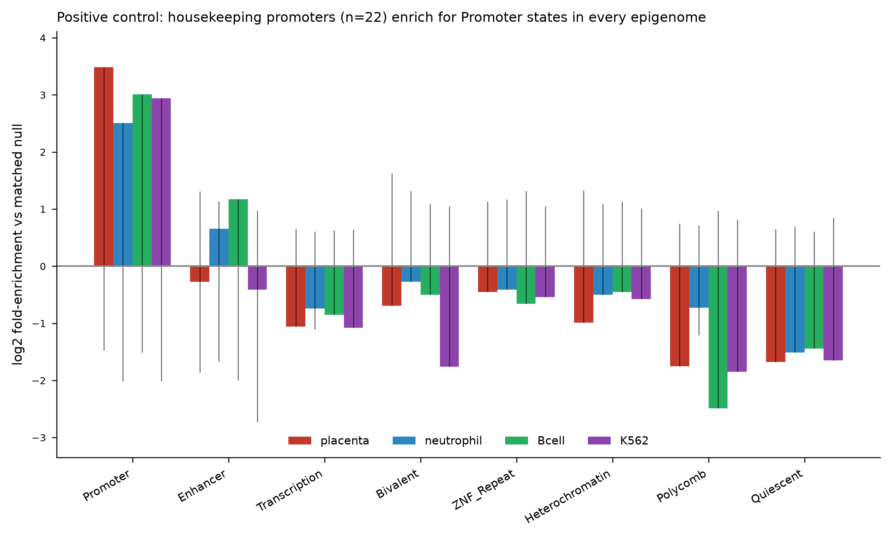
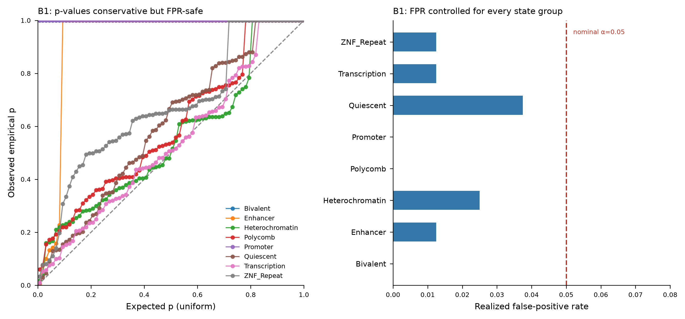

# cfdna-chromatin-xai

**Explainable chromatin-state annotation and matched-null enrichment for cfDNA genomic regions (hg38).**

This is the chromatin-state interpretation module of a larger explainable-AI (XAI)
pipeline for cell-free DNA fetal-fraction analysis (an improved seqFF). Given a set
of *important* or *differential* cfDNA genomic regions — for example, the bins a
fetal-fraction model weights most heavily, or regions that differ between
sample groups — the module answers: **what chromatin biology sits under these
regions, and is that association statistically real?**

You bring the model, the tool explains it. `selection.shap_from_model(model, X)`
takes your **own fitted fetal-fraction model** (any scikit-learn-style regressor or
classifier — tree ensemble, linear, or arbitrary) plus its feature matrix and
computes a region-anchored SHAP attribution locally, so no cfDNA data has to leave
your machine. The resulting attribution flows straight into the chromatin-explanation
stages below. If your cohort is in **hg19** (as legacy seqFF cohorts are), the
`liftover` module crosses the hg19↔hg38 boundary on coordinates only, with QC.

It annotates each region against ChromHMM 18-state reference epigenomes, then tests
whether any state is enriched relative to a **GC / length / mappability-matched null
background** — the statistical control that separates a real biological signal from
the trivial fact that some genomic regions are GC-rich, gene-dense, or simply large.
Two further **state-independent layers** — a six-mark histone ChIP-seq fingerprint
and an open-chromatin DNase-seq layer — give orthogonal cross-checks on the ChromHMM
call using the same matched-null machinery.

## Why this module first

Of all the XAI layers one could build on top of important cfDNA regions
(chromatin state, cell-of-origin, cfGWAS, ...), chromatin state is the one with
**external ground truth**: reference epigenomes, housekeeping-gene promoters, and
gene deserts have known answers, so the engine can be *benchmarked* rather than
merely run. Building it first also establishes the statistical scaffolding — the
matched null, the calibration harness — that every later layer inherits.

## What's validated here

The engine is exercised end-to-end on real hg38 data (`scripts/run_demo.py`):

**Positive control (B2).** Promoter windows (±2 kb) of 22 housekeeping genes are
annotated against four epigenomes. In every one, they enrich for **Promoter**
chromatin states relative to the matched null:

| Epigenome  | Promoter log2 fold-enrichment | empirical p |
|------------|------------------------------:|------------:|
| placenta   | +3.49 | 0.002 |
| neutrophil | +2.51 | 0.002 |
| B cell     | +3.01 | 0.002 |
| K562       | +2.94 | 0.002 |

Quiescent, Polycomb and Transcription states are correspondingly *depleted* — the
expected signature of constitutively active promoters.



**Calibration (B1).** Signal-free query sets (regions drawn from the same
mappable-genome process as the background) are fed through the engine. The realized
false-positive rate is **controlled at every state group** (0.000–0.037, all ≤ the
nominal α=0.05). The empirical p-values are *conservative* rather than perfectly
uniform — a known discreteness effect for rare states at small n (see
[docs/benchmarking.md](docs/benchmarking.md) for the diagnosis and the planned
refinement). Conservative-but-safe is the correct failure mode for a discovery gate:
it never inflates false positives.



## Install

```bash
git clone https://github.com/USER/cfdna-chromatin-xai
cd cfdna-chromatin-xai
pip install -e .                     # core: annotation + enrichment
pip install -e .[xai]                # + SHAP-from-model and hg19<->hg38 liftover
python scripts/fetch_fasta.py        # one-time: hg38 chr19-22 FASTA (~63 MB, gitignored)
python scripts/run_demo.py           # reproduces the figures above
```

The four ChromHMM 18-state reference BEDs (~17 MB) ship in `data/`; the sequence
FASTA is fetched separately because it is large and re-downloadable. The `[xai]`
extra pulls `shap`, `scikit-learn`, `joblib`, and `pyliftover` — needed only for
the SHAP-from-model and liftover paths, so the core install stays lightweight.

## Usage

```python
from cfdna_chromatin import references as R, genome as G, engine as E

seg    = {t: R.load_segmentation(f"data/{t}_{a}.bed.gz", chroms=["chr19"])
          for t, a in R.REFERENCE_ACCESSIONS.items()}
genome = G.load_genome({"chr19": "data/fasta/chr19.fa.gz"})

regions = [("chr19", 1_000_000, 1_050_000), ...]      # your important/differential bins

# 1. annotate one region
ann = E.annotate_region("chr19", 1_000_000, 1_050_000, seg["placenta"])
#    -> {"dominant_state": "TssA", "composition": {...}, "active_fraction": 0.9}

# 2. test state enrichment vs a matched null
nm  = E.NullModel(genome=genome, chroms=["chr19"], seed=0)
res, meta = E.enrichment_test(regions, seg["placenta"], nm, by="group")
#    -> per-group log2 fold-enrichment, bootstrap CI, empirical p

# 3. orthogonal histone-mark cross-check (independent of ChromHMM)
from cfdna_chromatin import histone as H
panel = H.load_mark_panel("data/histone", chroms=["chr19"])   # 6 marks x 4 tissues
mres, _ = H.mark_enrichment_test(regions, panel["placenta"], nm)
#    -> per-mark peak-coverage log2 fold-enrichment vs the same matched null

# 4. orthogonal open-chromatin cross-check (DNase-seq, also ChromHMM-independent)
from cfdna_chromatin import accessibility as A
apanel = A.load_access_panel("data/access", chroms=["chr19"])  # 1 track x 5 tissues
ares, _ = A.access_enrichment_test(regions, apanel["placenta"], nm)
#    -> DNase peak-coverage log2 fold-enrichment vs the same matched null

# 5. compartment attribution -- which cell-of-origin explains each region?
from cfdna_chromatin import attribute as AT
hpanel = H.load_mark_panel("data/histone", chroms=["chr19","chr20","chr21","chr22"])
per, summ = AT.attribute_signal(regions, hpanel, panel="fetal")
#    -> each region labelled signal / inflammation / background / ambiguous / unexplained
#    -> summ["signal_fraction"] = how much of the set is cell-of-origin vs background

# 6. importance/selection front-end -- rank bins by model attribution, then decompose
from cfdna_chromatin import selection as SEL
ranked = SEL.rank_by_shap(shap_df)              # samples x bins SHAP matrix -> ranked bins
#   (or SEL.rank_by_differential(matrix, labels) for a model-free Mann-Whitney ranking)
regions = SEL.to_regions(ranked, top_n=100)     # feed the top bins straight into attribution
res, J = SEL.compartment_importance_test(ranked, hpanel, panel="fetal")
#    -> res["signal_specific"] / res["background_specific"]: does importance concentrate in
#       cell-of-origin or background chromatin, corrected for the genome-wide openness confound
```

### Fetal-fraction workflow (seqFF++): explain your own model

If you already have a fitted fetal-fraction model, the whole SHAP → chromatin-biology
chain runs from one command. Feature columns must be genomic-bin names
(`chrX:start-end`) so the attribution is region-anchored.

```bash
# (A) hand it your model + feature matrix -- SHAP is computed locally
python scripts/run_ff_shap.py --model ff_model.pkl --matrix X.csv --out ff_ranked.csv

# (B) or a precomputed SHAP matrix (samples x bins) -- skip straight to the biology
python scripts/run_ff_shap.py --shap shap_ff.csv

# hg19 cohort? lift the ranked bins hg19->hg38 before the reference lookup (QC'd)
python scripts/run_ff_shap.py --model ff_model.pkl --matrix X_hg19.csv --from-build hg19
```

```python
from cfdna_chromatin import selection as SEL, liftover as LO

# 1. region-anchored SHAP from YOUR model (explainer auto-selected:
#    tree -> TreeExplainer, linear -> LinearExplainer, else KernelExplainer)
sv = SEL.shap_from_model(model, X)          # -> samples x bins signed SHAP frame
ranked = SEL.rank_by_shap(sv)               # keep the sign: FF is directional

# 2. hg19 -> hg38 build crossing, coordinates only, with QC
lifted, qc = LO.lift_regions(ranked, from_build="hg19", to_build="hg38")
print(qc["mapping_rate"])                    # fraction of bins that lifted cleanly

# 3. placenta cell-of-origin positive control (fetal panel)
res, J = SEL.compartment_importance_test(lifted, hpanel, panel="fetal")
#    res["signal_specific"] here reads as the placenta(signal)-vs-blood contrast:
#    a real FF model's important regions should ENRICH placenta-specific chromatin.
```

**The placenta positive control is the key check.** For a genuine fetal-fraction
model, the SHAP-important regions should concentrate in **placenta-specific** open
chromatin — the fetal cell-of-origin. If they instead point at maternal blood, the
model is likely riding a coverage/GC artifact rather than fetal biology, and
`run_ff_shap.py` flags that explicitly.

For the recommended hg19 workflow — pre-lifting the small, static reference tracks
*down* to hg19 once, so the whole analysis runs hg19-native — use
`liftover.lift_reference_bed()` on each shipped reference BED and run with
`--from-build hg38` against the resulting hg19 bundle.

### Application panels

The chromatin engine is **feature-agnostic** — it scores any per-region set against
any reference. A *panel* (`references.PANELS`) declares which references to load for one
cfDNA application and what role each plays. The bundled panel is:

- **`fetal`** — placental (fetal) signal on a maternal hematopoietic + solid-tissue
  background (seqFF++ fetal fraction). `attribute_signal(..., panel="fetal")` labels each
  region **signal** (cell-of-origin), **inflammation** (activated-myeloid axis),
  **background** (resting hematopoietic), **ambiguous**, or **unexplained**, and
  `compartment_importance_test` reports whether SHAP importance concentrates in the
  placenta cell-of-origin compartment once the genome-wide openness confound is removed.

The engine itself is panel-agnostic: additional panels can be declared from the bundled
references without touching the engine code.

### Tissue-of-origin track (seqFF++)

`analysis/fetal_fraction/` carries an end-to-end tissue-of-origin readout that maps
per-feature |SHAP| from a fitted fetal-fraction model onto a 9-tissue hg19 50 kb
openness atlas and asks **which tissue's specific open chromatin the important bins
concentrate in** — placenta should lead for a genuine FF model.

```bash
# extract per-feature |SHAP| from a glmnet FF model in place (no per-patient data leaves)
Rscript analysis/fetal_fraction/extract_ff_shap.R --model ff_model.rds --x X.csv --out ff_shap.csv
# score against the shipped atlas
python analysis/fetal_fraction/run_ff_tissue_track.py --importance ff_shap.csv --outdir out_ff_tissue
```

See `analysis/fetal_fraction/FF_IMPLEMENTATION.md` for the full AWS-instance recipe and
`analysis/fetal_fraction/reference/README.md` for the atlas layout.

## Reference epigenomes

Roadmap/EpiMap ChromHMM 18-state model (identical vocabulary across all four):

| Key          | ENCODE accession | Biosample | Role in cfDNA context |
|--------------|------------------|-----------|-----------------------|
| placenta     | ENCFF024IDF | placenta male embryo (85 d) | fetal signal (`fetal`) |
| keratinocyte | ENCFF131MHN | keratinocyte | epithelial reference track |
| neutrophil   | ENCFF412COT | neutrophil male | hematopoietic background |
| Bcell        | ENCFF004HFC | B cell female adult | hematopoietic background |
| monocyte     | (histone/DNase only) | CD14+ monocyte | activated-myeloid / inflammation axis |
| K562         | ENCFF026ZCC | K562 | unrelated-lineage control |

All ChromHMM segmentations share the identical 18-state EpiMap vocabulary; each tissue
also carries 6 histone marks + a DNase track (monocyte has histone + DNase only — no
18-state ChromHMM exists for it). See [docs/data_provenance.md](docs/data_provenance.md)
for full provenance, accessions, and the two documented monocyte caveats.

## Layout

```
src/cfdna_chromatin/    engine, references, genome, histone, accessibility,
                        attribute (compartment attribution), benchmark,
                        selection (importance front-end + shap_from_model),
                        liftover (hg19<->hg38 build crossing)
scripts/                fetch_fasta.py, fetch_histone.py, fetch_access.py,
                        fetch_ff_reference.py, run_demo.py,
                        run_ff_shap.py (fetal-fraction SHAP -> placenta biology),
                        run_shap_decomposition.py
analysis/fetal_fraction/ tissue-of-origin track: build_openness_atlas.py,
                        extract_ff_shap.R, run_ff_tissue_track.py,
                        ff_tissue_proportion.py, reference/ (shipped hg19 atlas)
tests/                  fast unit tests (no network/FASTA needed)
data/                   ChromHMM reference BEDs; histone/ ChIP-seq + access/ DNase
                        peak subsets (FASTA fetched into data/fasta/)
examples/               housekeeping-gene TSS windows used by the demo
docs/                   benchmarking design, provenance, figures
```

## Benchmarking roadmap

This release implements **B1 (calibration)** and the **B2 positive control**. The
full four-tier strategy — B2 negative controls, B3 recovery of known cfDNA biology
(placental vs. hematopoietic, direction-aware), B4 orthogonal ground truth (held-out
ENCODE tissue + WGBS methylation cross-check) — is specified in
[docs/benchmarking.md](docs/benchmarking.md).

## License

MIT — see [LICENSE](LICENSE).
